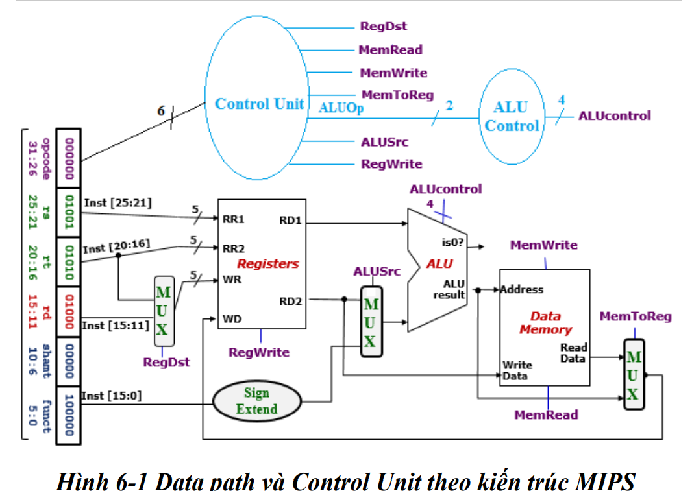
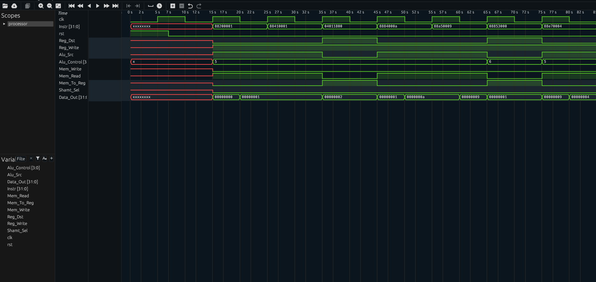

**MIPS-32 Bit Processor in Verilog**

---

## 📋 Table of Contents
1. [Project Overview](#project-overview)  
2. [Key Features](#key-features)  
3. [Architecture and Pipeline Stages](#architecture-and-pipeline-stages)  
4. [Instruction Set](#instruction-set)  
5. [Module Breakdown](#module-breakdown)  
6. [Getting Started](#getting-started)  
7. [Simulation and Testbench](#simulation-and-testbench)  
8. [Usage Example](#usage-example)  
9. [Future Improvements](#future-improvements)
---

<a name="project-overview"></a>
## 📝 Project Overview
A 32-bit MIPS-style processor implemented in Verilog with a clean, modular pipeline design. This project provides an educational platform for understanding core processor components: instruction fetch, decode, execution, memory access, and write-back.

**Key goals:**
- Illustrate core pipeline concepts  
- Simplify simulation interfacing  
- Enable extensibility for custom instructions  

---

<a name="key-features"></a>
## 🚀 Key Features
- **Custom Logic Parsing:** Tailored 32-bit MIPS instruction formats to fit course constraints.  
- **Optimized Resource Usage:** Streamlined modules minimize combinational logic without sacrificing clarity.  
- **Extended Instruction Set:** Supports additional arithmetic, logic, and shift operations beyond the basic MIPS subset.  
- **Modular Design:** Separate modules for control, datapath, ALU, register file, and data memory for maintainability.  

---

<a name="architecture-and-pipeline-stages"></a>
## 🏗️ Architecture and Pipeline Stages
The processor is organized into five sequential stages:

1. **Instruction Fetch (IF):**  
   - **Module:** `processor.v`  
   - Fetches 32-bit instructions injected by the testbench (no external I/O).  
2. **Instruction Decode (ID):**  
   - **Modules:** `controller.v`, `register.v`  
   - Decodes opcode, reads source registers, extends immediates, and generates control signals.  
3. **Execution (EX):**  
   - **Modules:** `ALU.v`, `datapath.v`  
   - Performs arithmetic, logic, comparison, and shift operations.  
4. **Memory Access (MEM):**  
   - **Module:** `data_memory.v`  
   - Executes load/store operations between register and memory.  
5. **Write-Back (WB):**  
   - Writes ALU or memory results back into the register file.
- **Architecture**:

---

<a name="instruction-set"></a>
## 🧮 Instruction Set
| Category     | Instructions                                 |
|--------------|----------------------------------------------|
| Arithmetic   | `ADD`, `SUB`, `INC`, `DEC`                   |
| Logical      | `AND`, `OR`, `XOR`, `NOT`                    |
| Comparison   | `SLT`, `SLL`, `SRL`, `SRA`                   |
| Memory       | `LW` (Load Word), `SW` (Store Word)          |

---

<a name="module-breakdown"></a>
## 🗂️ Module Breakdown
| File             | Responsibility                                                      |
|------------------|---------------------------------------------------------------------|
| `processor.v`    | Top-level pipeline control; instantiates all pipeline stages        |
| `controller.v`   | Instruction decoding and control signal generation                  |
| `register.v`     | 32-entry register file with synchronous write and asynchronous read |
| `ALU.v`          | Arithmetic and logic operations                                     |
| `datapath.v`     | Muxing, forwarding logic, and ALU integration                       |
| `data_memory.v`  | Data memory model for load/store                                    |

---

<a name="getting-started"></a>
## 🏁 Getting Started
**Prerequisites:** Verilog simulator (ModelSim, Icarus, Vivado), GNU Make (optional)

**Clone repository:**
```bash
git clone https://github.com/NguyenHoanKhanh/MIPS-basic-by-Verilog.git
cd MIPS-basic-by-Verilog
```
<a name="simulation-and-testbench"></a>
## 🔬 Simulation and Testbench 
- **Run with Icarus Verilog**: iverilog -o mips_tb \ tb_processor.v \ processor.v \ controller.v \ register.v \ ALU.v \ datapath.v \ data_memory.v - vvp mips_tb

- **Optional waveform** : gtkwave procee.vcd

- **Results**:



<a name="future-improvements"></a>
## 🔧 Future Improvements 

- **External Instruction Memory**: Support .hex/.txt instruction loading.

- **Hazard Detection & Forwarding**: Add stall logic and forwarding paths.

- **Exceptions/Interrupts**: Implement exception handling.

- **Branch Prediction**: Improve branch throughput.
